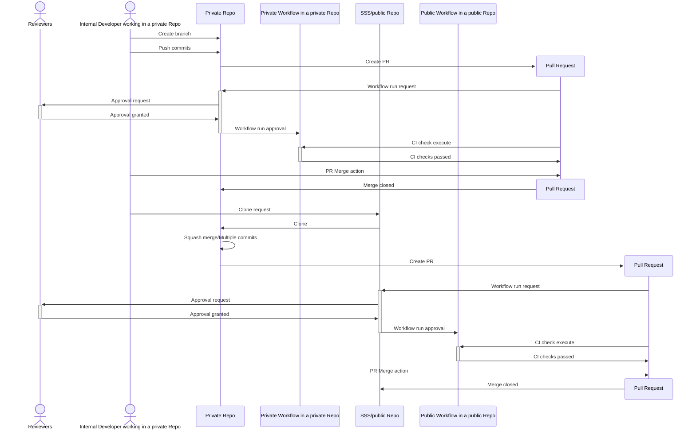
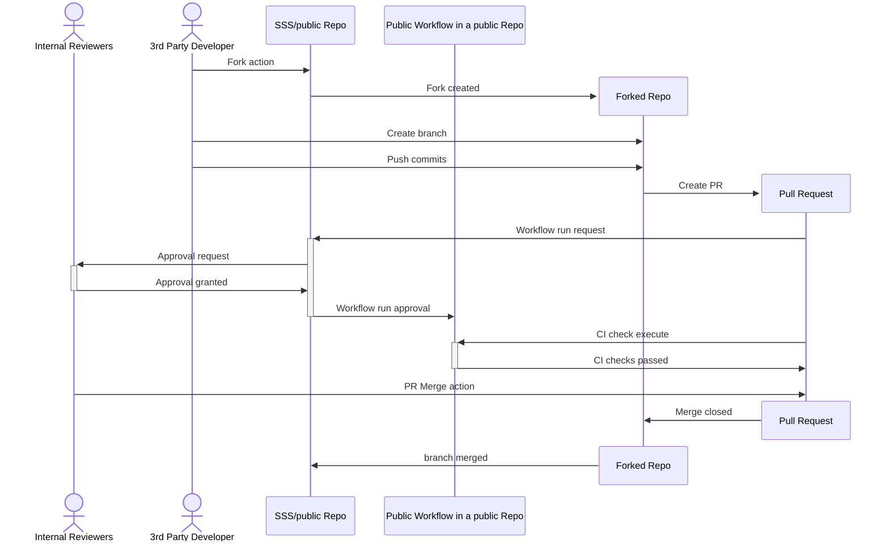

```mermaid
sequenceDiagram
  actor R as Reviewers
  actor T as Internal Developer working in a private Repo
  participant F as Private Repo
  participant I as Private Workflow in a private Repo
  participant SSS as SSS/public Repo
  participant W as Public Workflow in a public Repo
  T ->> F: Create branch
  T ->> F: Push commits
  create participant P as Pull Request
  F ->> P: Create PR
  P ->>+ F: Workflow run request
  F ->>+ R: Approval request
  R ->>- F: Approval granted
  F ->>- I: Workflow run approval
  P ->>+ I: CI check execute
  I ->>- P: CI checks passed
  T ->> P: PR Merge action
  destroy P
  P ->> F: Merge closed
  T ->> SSS: Clone request
  SSS ->> F: Clone
  F ->> F: Squash merge/Multiple commits
  create participant P2 as Pull Request
  F ->> P2: Create PR
  P2 ->>+ SSS: Workflow run request
  SSS ->>+ R: Approval request
  R ->>- SSS: Approval granted
  SSS ->>- W: Workflow run approval
  P2 ->>+ W: CI check execute
  W ->>- P2: CI checks passed
  T ->> P2: PR Merge action
  destroy P2
  P2 ->> SSS: Merge closed
```

```mermaid
sequenceDiagram
  actor M as Internal Reviewers
  actor T as 3rd Party Developer
  participant SSS as SSS/public Repo
  participant I as Public Workflow in a public Repo
  T ->> SSS: Fork action
  create participant F as Forked Repo
  SSS ->> F: Fork created
  T ->> F: Create branch
  T ->> F: Push commits
  create participant P as Pull Request
  F ->> P: Create PR
  P ->>+ SSS: Workflow run request
  SSS ->>+ M: Approval request
  M ->>- SSS: Approval granted
  SSS ->>- I: Workflow run approval
  P ->>+ I: CI check execute
  I ->>- P: CI checks passed
  M ->> P: PR Merge action
  destroy P
  P ->> F: Merge closed
  destroy F
  F ->> SSS: branch merged
```
