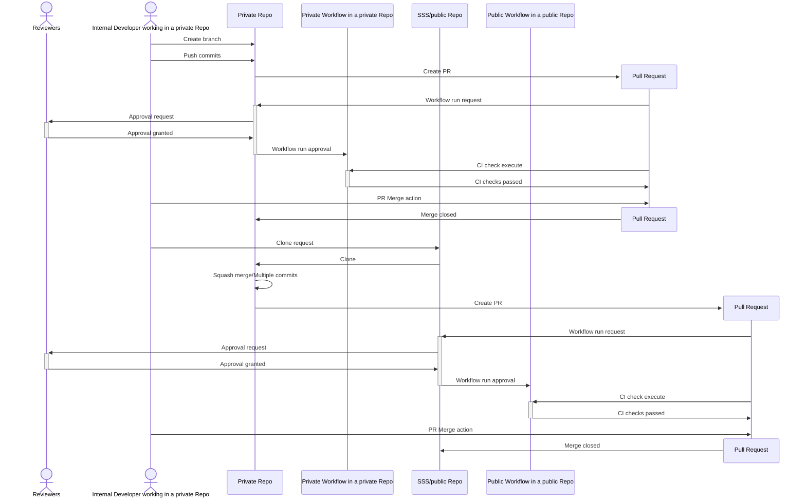
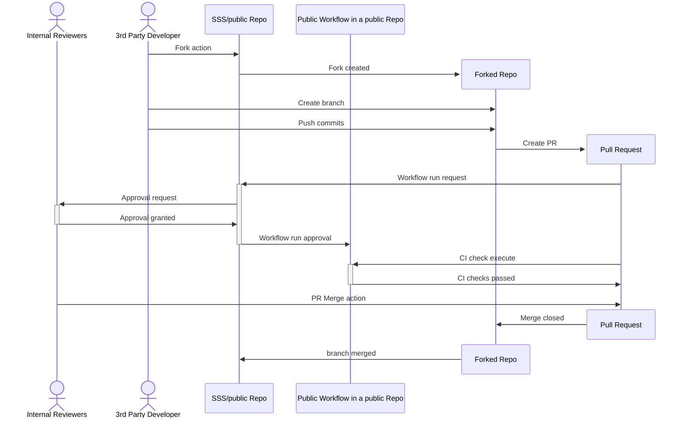
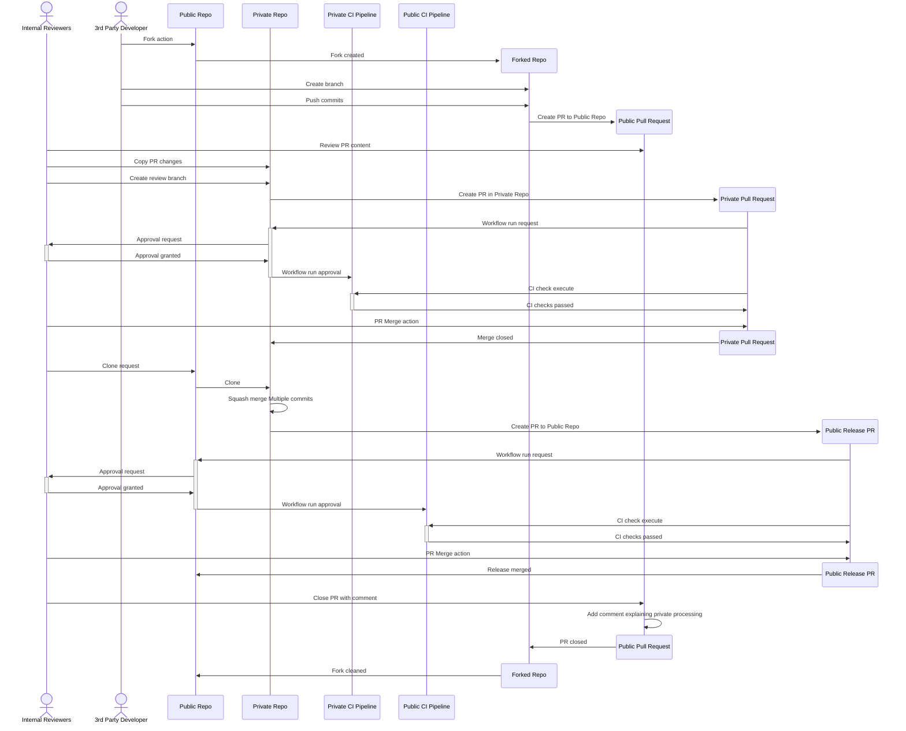

```mermaid
sequenceDiagram
  actor R as Reviewers
  actor T as Internal Developer working in a private Repo
  participant F as Private Repo
  participant I as Private Workflow in a private Repo
  participant SSS as SSS/public Repo
  participant W as Public Workflow in a public Repo
  T ->> F: Create branch
  T ->> F: Push commits
  create participant P as Pull Request
  F ->> P: Create PR
  P ->>+ F: Workflow run request
  F ->>+ R: Approval request
  R ->>- F: Approval granted
  F ->>- I: Workflow run approval
  P ->>+ I: CI check execute
  I ->>- P: CI checks passed
  T ->> P: PR Merge action
  destroy P
  P ->> F: Merge closed
  T ->> SSS: Clone request
  SSS ->> F: Clone
  F ->> F: Squash merge/Multiple commits
  create participant P2 as Pull Request
  F ->> P2: Create PR
  P2 ->>+ SSS: Workflow run request
  SSS ->>+ R: Approval request
  R ->>- SSS: Approval granted
  SSS ->>- W: Workflow run approval
  P2 ->>+ W: CI check execute
  W ->>- P2: CI checks passed
  T ->> P2: PR Merge action
  destroy P2
  P2 ->> SSS: Merge closed
```

```mermaid
sequenceDiagram
  actor M as Internal Reviewers
  actor T as 3rd Party Developer
  participant SSS as SSS/public Repo
  participant I as Public Workflow in a public Repo
  T ->> SSS: Fork action
  create participant F as Forked Repo
  SSS ->> F: Fork created
  T ->> F: Create branch
  T ->> F: Push commits
  create participant P as Pull Request
  F ->> P: Create PR
  P ->>+ SSS: Workflow run request
  SSS ->>+ M: Approval request
  M ->>- SSS: Approval granted
  SSS ->>- I: Workflow run approval
  P ->>+ I: CI check execute
  I ->>- P: CI checks passed
  M ->> P: PR Merge action
  destroy P
  P ->> F: Merge closed
  destroy F
  F ->> SSS: branch merged
```

```mermaid
sequenceDiagram
    actor M as Internal Reviewers
    actor T as 3rd Party Developer
    participant PUB as Public Repo
    participant PRIV as Private Repo
    participant PCI as Private CI Pipeline
    participant PUBCI as Public CI Pipeline

    T ->> PUB: Fork action
    create participant F as Forked Repo
    PUB ->> F: Fork created
    T ->> F: Create branch
    T ->> F: Push commits
    
    create participant PR as Public Pull Request
    F ->> PR: Create PR to Public Repo
    
    M ->> PR: Review PR content
    M ->> PRIV: Copy PR changes
    M ->> PRIV: Create review branch
    
    create participant PR2 as Private Pull Request
    PRIV ->> PR2: Create PR in Private Repo
    
    PR2 ->>+ PRIV: Workflow run request
    PRIV ->>+ M: Approval request
    M ->>- PRIV: Approval granted
    
    PRIV ->>- PCI: Workflow run approval
    PR2 ->>+ PCI: CI check execute
    PCI ->>- PR2: CI checks passed
    
    M ->> PR2: PR Merge action
    destroy PR2
    PR2 ->> PRIV: Merge closed
    
    M ->> PUB: Clone request
    PUB ->> PRIV: Clone
    PRIV ->> PRIV: Squash merge Multiple commits
    
    create participant PR3 as Public Release PR
    PRIV ->> PR3: Create PR to Public Repo
    PR3 ->>+ PUB: Workflow run request
    PUB ->>+ M: Approval request
    M ->>- PUB: Approval granted
    
    PUB ->>- PUBCI: Workflow run approval
    PR3 ->>+ PUBCI: CI check execute
    PUBCI ->>- PR3: CI checks passed
    
    M ->> PR3: PR Merge action
    destroy PR3
    PR3 ->> PUB: Release merged
    M ->> PR: Close PR with comment
    PR ->> PR: Add comment explaining private processing
    
    destroy PR
    PR ->> F: PR closed
    destroy F
    F ->> PUB: Fork cleaned
```